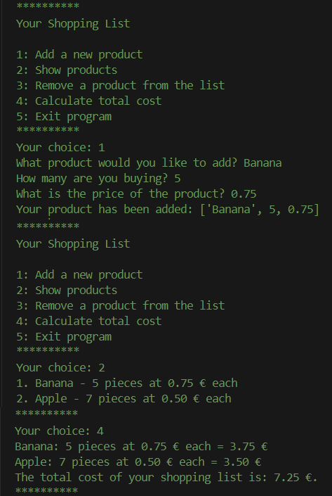

# Exercises

A repository containing exercises to track continuous improvements in programming. 

---

## Topics

### **01_Basics**
- `HelloWorld.py`: A simple script used to test GitHub settings and print "Hello, World!"
- `Variables.py`: What is a variable, how do I use it?
  - Assigning values to variables of different data types (strings, integers, floats, booleans).
  - Reassigning variables and changing their values or types throughout the code.
  - Assigning multiple variables in one line.
  - Checking the type of a variable using `type()`.
### **02_Control_Structures**
- `Loops.py`: Basic introduction into loops:
  - `while` loops for conditional execution.
  - `for` loops for iterating over sequences.
  - Examples including skipping iterations, breaking out of loops, and reverse looping.

### **03_Functions**
- `Basics.py`: Beginner-friendly examples showcasing:
  - Defining a simple function.
  - Using parameters to pass values.
  - Returning values from functions.
  - Getting user input and performing calculations.
  - 
### **04_Data_Structures**
- `Collections.py`: Explaination and examples of collection types:
  - Lists
  - Sets
  - Tuples
 - `Dictionaries.py`: a special type of collection
### **05_Modules**
- TBC

### **06_OOP_Basics**
- TBC

### **07_Projects**
- `ShoppingList.py`: A fully functional shopping list program where you can:
  - Add, view, and remove products.
  - Calculate the total cost.
  - Track the quantity and price of each items.
  - 
- `ToDoList.py`: A To-do-list where you can:
  - Create and add tasks to a list
  - Display the list
  - Remove items
  - 
---

## Goals

- **Practice programming concepts**
- **Track progress**
---
